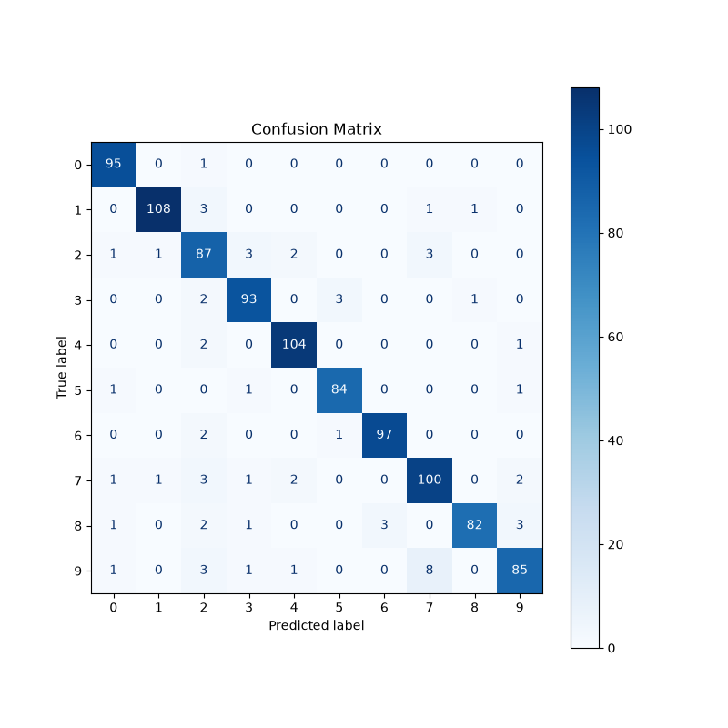
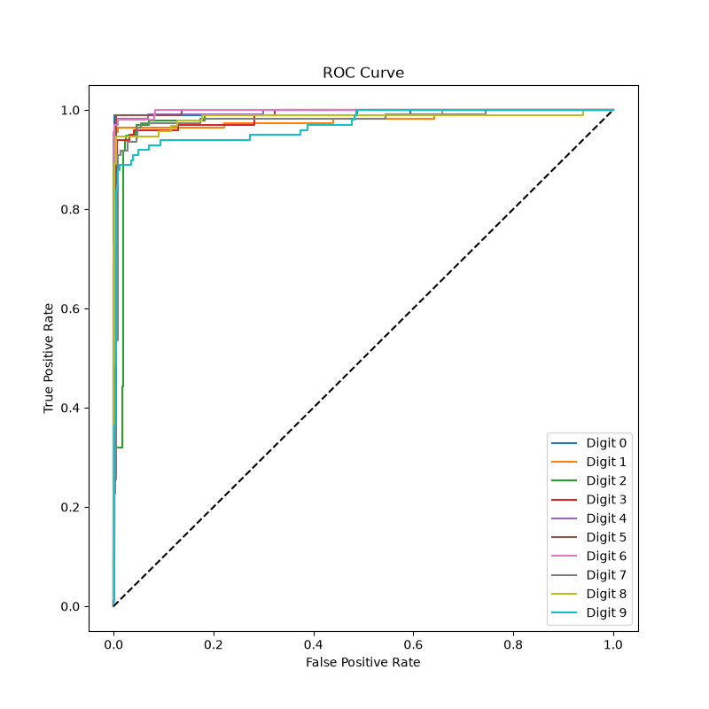
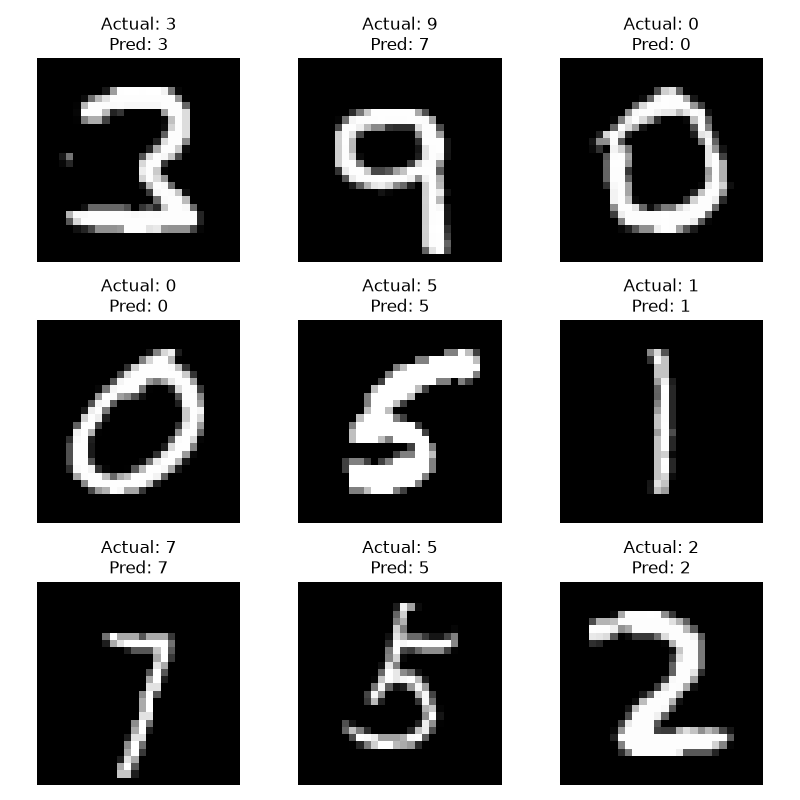

# Handwritten Digit Recognition using Support Vector Machine (SVM)

A complete machine learning project that classifies handwritten digits (0–9) using a **Support Vector Machine (SVM)** trained on the **MNIST Handwritten Digits Dataset**.

This project demonstrates an end-to-end machine learning pipeline, covering everything from data preprocessing and hyperparameter tuning to model evaluation, visualization, model persistence, and custom image prediction. In addition to evaluating the model on unseen test data, users can also provide their own handwritten digit images and receive predictions from the trained model.

---

# Features

* Multi-class handwritten digit classification using **Support Vector Machine (SVM)**.
* Feature scaling using **StandardScaler**.
* Hyperparameter optimization using **GridSearchCV**.
* **5-Fold Cross Validation** for robust model selection.
* Automatic selection of the best hyperparameter combination.
* Model calibration for probability predictions using **CalibratedClassifierCV**.
* Performance evaluation using multiple classification metrics.
* Confusion Matrix visualization.
* Multi-class ROC Curve generation.
* ROC-AUC Score calculation.
* Sample prediction visualization.
* Save and reload the trained model using **Joblib**.
* Predict handwritten digits from custom user-provided images.
* Complete end-to-end machine learning workflow.

---

# Project Structure

```text
Handwritten-Digit-Recognition-SVM/
│
├── MNIST.py
├── README.md
├── Requirements.txt
│
├── images/
│   ├── confusion_matrix.png
│   ├── roc_curve.png
│   └── sample_predictions.png
```

---

# Dataset

**Dataset:** MNIST Handwritten Digits

The MNIST dataset contains grayscale images of handwritten digits ranging from **0 to 9**.

Each sample consists of:

* Image Size: **28 × 28 pixels**
* Features: **784**
* Classes: **10 (Digits 0–9)**

A subset of the dataset was used during training to reduce computation time while maintaining strong performance.

---

# Project Workflow

1. Import Required Libraries
2. Load the MNIST Dataset
3. Separate Features and Labels
4. Split the Dataset into Training and Testing Sets
5. Standardize the Feature Values
6. Perform Hyperparameter Tuning using GridSearchCV
7. Train the Best Support Vector Machine
8. Calibrate the Model to Enable Probability Predictions
9. Generate Predictions on the Test Dataset
10. Evaluate Model Performance
11. Generate Performance Visualizations
12. Save the Trained Model and Scaler
13. Predict Custom Handwritten Digit Images

---

# Hyperparameter Tuning

Instead of manually selecting model parameters, **GridSearchCV** was used to automatically search for the best-performing hyperparameter combination.

The following parameters were optimized:

* **C**
* **Gamma**
* **Kernel (RBF)**

The search was performed using **5-Fold Cross Validation**, ensuring that each parameter combination was evaluated across multiple training and validation splits before selecting the final model.

---

# Model Evaluation

The trained model was evaluated using the following metrics:

* Accuracy
* Precision
* Recall
* F1 Score
* Classification Report
* Confusion Matrix
* ROC Curve
* ROC-AUC Score

Using multiple evaluation metrics provides a more comprehensive understanding of model performance across all digit classes.

---

# Results

## Confusion Matrix

The Confusion Matrix provides a detailed breakdown of correct and incorrect predictions for every handwritten digit.



---

## ROC Curve

The ROC Curve illustrates the classification performance of the model across all digit classes using a One-vs-Rest approach.



---

## Sample Predictions

Sample predictions displaying the original handwritten digit together with its actual label and predicted label.



---

# Custom Image Prediction

The project includes an interactive prediction feature that allows users to classify their own handwritten digit images.

The prediction pipeline automatically:

* Loads the selected image.
* Converts it to grayscale.
* Resizes it to **28 × 28** pixels.
* Converts the image into a numerical feature vector.
* Applies the same feature standardization used during model training.
* Predicts the handwritten digit.
* Displays the predicted digit along with the model's confidence score.

This demonstrates how the trained model can be used for real-world inference instead of only evaluating predefined test samples.

**Note:** Since the model is trained on the MNIST dataset, the best results are achieved with clean, centered handwritten digits that closely resemble MNIST images.

---

# Installation

Clone the repository:

```bash
git clone <repository-url>
```

Install the required libraries:

```bash
pip install -r Requirements.txt
```

Run the project:

```bash
python MNIST.py
```

After training is complete, the program also allows you to test your own handwritten digit images by providing the image path when prompted.

---

# Requirements

Install all required libraries using:

```bash
pip install -r Requirements.txt
```

Main dependencies:

* NumPy
* Matplotlib
* Seaborn
* Scikit-learn
* Pillow
* Joblib

---

# Learning Outcomes

This project demonstrates practical implementation of:

* Support Vector Machines (SVM)
* Multi-class Classification
* Feature Standardization
* Hyperparameter Tuning
* Grid Search
* Cross Validation
* Model Calibration
* Probability-Based Predictions
* Performance Evaluation
* ROC Curve Analysis
* ROC-AUC Score
* Confusion Matrix Analysis
* Image Preprocessing
* Model Serialization using Joblib
* End-to-End Machine Learning Pipelines

---

# Future Improvements

Possible future enhancements include:

* Train using the complete MNIST dataset.
* Improve preprocessing for custom handwritten images through automatic digit centering and normalization.
* Develop a graphical user interface for digit prediction.
* Compare SVM performance with Convolutional Neural Networks (CNNs).
* Deploy the project as a web application using Streamlit or Flask.
* Extend the project to recognize handwritten characters beyond digits.

---

# Conclusion

This project showcases the complete development of a handwritten digit recognition system using Support Vector Machines. It combines data preprocessing, hyperparameter optimization, probability calibration, comprehensive performance evaluation, visualization, model persistence, and custom image inference into a single end-to-end machine learning application.

It serves as both a practical implementation of classical machine learning techniques and a strong foundation for future computer vision and deep learning projects.
